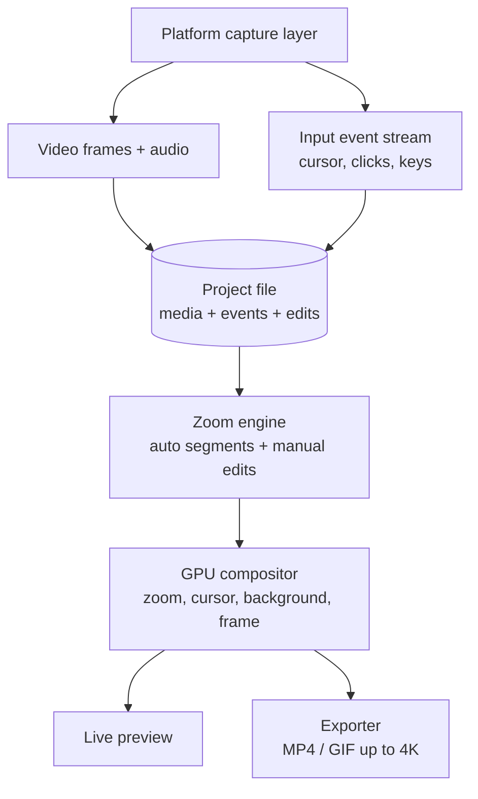
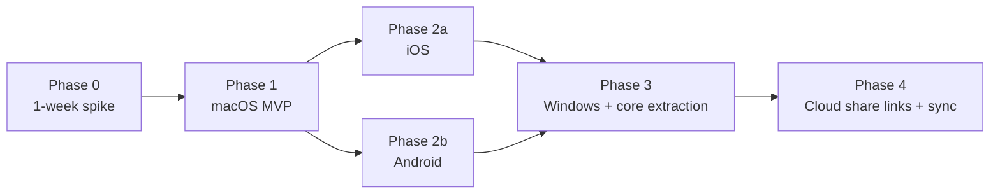
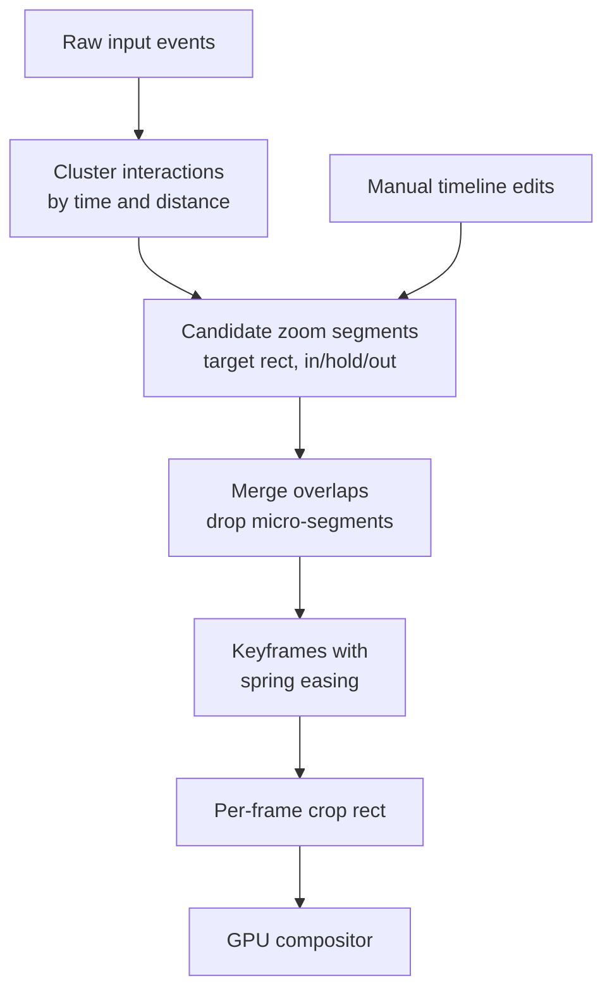
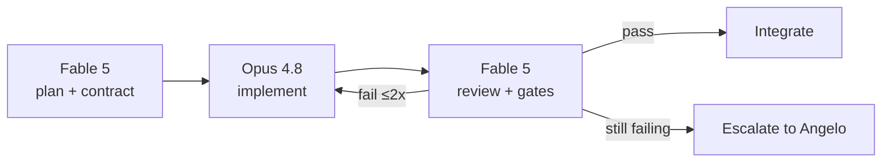

# zoooomrec — Cross-Platform Zoomable Screen Recorder — Master Plan (2026-07-07)

> **Name**: `zoooomrec` (confirmed by Angelo 2026-07-07, as typed — 4 o's; verify handle/domain availability).
> **Model**: **Open source** (confirmed by Angelo 2026-07-07) — see §3.5 for license + build-vs-fork analysis.
> **Goal**: A Screenfully / Screen Studio-class app: record the screen, then produce polished demo videos with smooth zoom-in/zoom-out on the parts that matter — on **mobile (iOS + Android)** and **desktop (macOS first, Windows later)**.

---

## 1. What we're building

Record → auto/manual zoom → style → export. The user records their screen; the app captures interaction metadata alongside the video; an editor turns that into a professional demo with animated zooms, smooth cursor, padded backgrounds, and device frames; export to MP4/GIF at up to 4K.

### What the references actually are (research, 2026-07-07)

| Product                                          | Platform                         | Zoom model                                                                                                                    | Notes                                                                                                                                                                                                                                                                                                                                                                                                 |
| ------------------------------------------------ | -------------------------------- | ----------------------------------------------------------------------------------------------------------------------------- | ----------------------------------------------------------------------------------------------------------------------------------------------------------------------------------------------------------------------------------------------------------------------------------------------------------------------------------------------------------------------------------------------------- |
| **Screenfully**                                  | iOS 16+ (Android in development) | **Manual** zoom segments: add on timeline, set scale/duration, drag focus point on preview                                    | Templates, gradient/image backgrounds, device frames, 480p–4K export, 20–60 FPS, aspect-ratio presets, on-device processing, free tier + $9.99/mo / $59.99/yr Pro                                                                                                                                                                                                                                     |
| **Screen Studio** (desktop reference per Angelo) | macOS only                       | **Automatic** zoom follows cursor/clicks + manual timeline repositioning; vertical-mode export re-adjusts zooms automatically | Smooth synthetic cursor (resize/hide/loop after recording, hi-res system cursors), webcam selfie overlay that dodges the cursor, iPhone/iPad recording over USB with auto device frames, keystroke display overlay, mic + per-app system audio with local noise removal + voice normalization, local transcripts → subtitles, shareable style presets, MP4 4K60 + GIF + share links; $20/mo or $99/yr |

**Key takeaway**: Screenfully's mobile zoom is _manual_ — because mobile OSes don't let you capture system-wide taps. Desktop is where _automatic_ zoom-on-click is possible and expected. Our plan embraces this split instead of fighting it.

---

## 2. The core architectural insight: zoom is post-production, not capture

The zoom is **never** done while recording. Every serious app in this category does:

1. Capture the screen at **full native resolution** (plus audio).
2. Capture an **input-event stream** as metadata (cursor positions, clicks, key presses — desktop only).
3. Hide the real cursor from the capture and re-render a **synthetic cursor** (enables smoothing, resizing, hiding in post).
4. In the editor, generate **zoom segments** (auto from events on desktop; manual on mobile) that compile down to per-frame crop/scale transforms.
5. A **GPU compositor** renders: background + padded/rounded video + zoom transform + synthetic cursor → preview and export.

This means the product is really **two engines + thin platform shells**:

- **Capture engine** — per-platform, unavoidable native code.
- **Render/editor engine** — timeline model, zoom math, compositor. Highly shareable.

### The portable project file (day-1 decision)

Define `.zoooomrec` from the start: a folder/bundle containing the raw recording (`recording.mp4` or raw frames), `events.jsonl` (timestamped input events), and `project.json` (zoom segments, style, trims, export settings). Every platform reads/writes the same format → recordings made on iPhone can be polished on the Mac later (cross-device workflow = our differentiator, see §3).

---

## 3. Product positioning (why this wins)

- **Screen Studio is macOS-only. Screenfully is mobile-only.** Nobody owns the _cross-device_ story: record an app demo on your phone, AirDrop/sync it, auto-polish on the Mac — or do the whole thing on either device.
- Target users: indie devs, PMs, founders, support teams, App Store preview creators, bug reporters.
- Monetization: superseded by the open-source decision — see §3.5 (open-core / paid store binary / sponsors).

---

## 3.5 Open-source strategy + build-vs-fork (added 2026-07-07)

Angelo's decisions: name **zoooomrec**, project is **open source**. That triggered a landscape check: what already exists, and do we still need to build?

### What already exists (research, 2026-07-07)

| Project                                | Stack / Platform                              | Zoom capability                                                                     | License                                                               | Status                                                                                                                |
| -------------------------------------- | --------------------------------------------- | ----------------------------------------------------------------------------------- | --------------------------------------------------------------------- | --------------------------------------------------------------------------------------------------------------------- |
| **Cap** (cap.so)                       | Rust + Tauri; macOS + Windows + web dashboard | Studio-mode zooms, cursor effects, backgrounds, captions, share links, self-hosting | **AGPLv3** core; `scap-*` / `cap-camera-*` capture crates are **MIT** | Active — the flagship OSS player                                                                                      |
| **OpenScreen**                         | macOS / Windows / Linux                       | Auto + manual zooms, motion blur, blur regions, auto-captions                       | OSS, free for commercial use                                          | Active                                                                                                                |
| **Screenize**                          | Swift, macOS                                  | Auto-zoom from cursor/clicks, timeline editing                                      | OSS (check repo license before reuse)                                 | **Paused** (May 2026) — valuable Swift reference code                                                                 |
| **open-recorder**                      | Native Swift, macOS (37 MB)                   | Screen Studio-style                                                                 | OSS                                                                   | Small/early                                                                                                           |
| **Recordly / ScreenArc / screen-demo** | Various desktop                               | Zoom animations, cursor tracking                                                    | MIT / OSS                                                             | Small/early                                                                                                           |
| **Mobile on-device (iOS/Android)**     | —                                             | —                                                                                   | —                                                                     | **Nothing exists.** Screenfully is closed-source with no OSS competitor; Android's Screenfully isn't even shipped yet |

### The gap: desktop OSS is crowded, mobile OSS is empty

Answer to "do we need to build this out?":

- **Desktop from scratch: no.** Half a dozen OSS projects already chase Screen Studio on desktop; Cap alone covers recording + zooms + share links + self-hosting on macOS **and** Windows. A seventh desktop clone adds little.
- **Mobile: yes — this is the build.** An on-device, open-source Screenfully (record → zoom segments → templates → 4K export, all local) does not exist on either platform. Screenfully charges $9.99/mo for zoom + 1080p+; an OSS app that ships those free is an instant wedge. This is where zoooomrec can be _first_, not seventh.
- **Desktop later, from the mobile codebase.** The Apple-stack reuse argument (§4) runs both directions: build the timeline model, zoom engine, and Metal compositor as platform-agnostic Swift packages on iOS, and the future macOS app inherits them (adding the auto-zoom event capture that mobile can't have). Keep the `.zoooomrec` project format day-1 so desktop interop (or even a Cap import bridge) stays open.

### Sequencing — DECIDED 2026-07-07: Option B, macOS-first (Angelo)

**Option A — mobile-first**: Phase 1 = iOS (Screenfully parity, open source), Phase 2 = Android, Phase 3 = macOS. Rationale: build only what the world lacks. _Not chosen._
**Option B — macOS-first (original §4 plan) — CHOSEN**: Angelo's primary use case is his own desktop demo recordings, so zoooomrec is built for its first real user. The §4 phasing (macOS → iOS → Android → Windows) stands unchanged, with two §3.5 adjustments carried over: (1) it's open source — Apache-2.0, public repo from day 1, no Stripe license server in Phase 1; (2) differentiation against the crowded desktop-OSS field (Cap, OpenScreen, …) comes from the auto-zoom quality bar (§8, native Swift/Metal vs their Electron/Tauri stacks) and later from being the only OSS tool with the cross-device mobile story.

### License recommendation

**Apache-2.0** (or MIT). **Not GPL/AGPL**, for one hard reason: GPL-family licenses conflict with App Store distribution terms (the VLC precedent — VLC had to relicense its mobile ports), and zoooomrec is mobile-centric. As sole copyright holder we could technically dual-license around it, but the moment outside contributors land AGPL code, App Store distribution becomes legally fragile unless we run a CLA. Apache-2.0 keeps store distribution clean and adds an explicit patent grant.

License hygiene consequences:

- We **cannot copy** code from Cap's AGPL core into a permissive zoooomrec. We **can** use its MIT `scap-*`/`cap-camera-*` crates (if we ever go Rust on desktop), read AGPL code for ideas and re-implement cleanly, and copy from MIT projects (Recordly, screen-demo — verify each repo's LICENSE first).
- Repo scaffolding at kickoff: `LICENSE` (Apache-2.0), `README` with demo GIF (made with the app), `CONTRIBUTING.md`, code of conduct, issue templates, CI badge. Public roadmap = this plan.

### Monetization under open source (replaces §3 pricing + Phase 1 licensing work)

- Free to build from source; **paid App Store/Play binary** (standard OSS-app convenience pattern) and/or free store binary with **paid Pro cloud features later** (share links, sync — the open-core model Cap uses).
- GitHub Sponsors from day 1; zero-pressure.
- Phase 1 scope change: drop the Stripe license server (−25h with CC / −55h without); landing page can start as GitHub Pages.

---

## 4. Platform strategy

**macOS first, then iOS, then Android, then Windows.** Reasons:

1. macOS has the best capture APIs (ScreenCaptureKit) and is where the paying category exists today.
2. **macOS → iOS reuse is huge**: the timeline model, zoom engine, Metal compositor, and AVFoundation export pipeline are the _same Apple stack_ — building macOS first gets us ~60% of the iOS editor for free.
3. Android is the odd one out (Kotlin + GLES/Media3) — do it once the editor spec is proven.
4. Windows last; at that point we decide whether to extract a shared Rust/C++ core or port natively (§9).

### Capture matrix (the hard native 20%)

| Capability                 | macOS                                                                | iOS                                                                                    | Android                                                                                   | Windows (later)                    |
| -------------------------- | -------------------------------------------------------------------- | -------------------------------------------------------------------------------------- | ----------------------------------------------------------------------------------------- | ---------------------------------- |
| Screen capture             | ScreenCaptureKit (12.3+)                                             | ReplayKit in-app; **Broadcast Upload Extension** for system-wide                       | MediaProjection + MediaCodec                                                              | Windows.Graphics.Capture           |
| System audio               | SCK (13+)                                                            | Broadcast ext. audio buffers                                                           | AudioPlaybackCapture (10+)                                                                | WASAPI loopback                    |
| Mic                        | AVCaptureDevice                                                      | AVAudioSession                                                                         | AudioRecord                                                                               | WASAPI                             |
| Input events for auto-zoom | ✅ CGEventTap / NSEvent global monitor (Input Monitoring permission) | ❌ impossible system-wide → **manual zoom** (+ in-app touch capture for own-app demos) | ⚠️ only via AccessibilityService (Play-policy risk) → ship **manual zoom**, revisit later | ✅ low-level hooks (`WH_MOUSE_LL`) |
| Hide real cursor           | `showsCursor=false`                                                  | n/a (touch)                                                                            | n/a (touch)                                                                               | capture flag                       |
| Consent model              | Screen Recording TCC prompt (once)                                   | Broadcast picker each session                                                          | **Consent every session** (Android 14/15+), FGS type `mediaProjection` mandatory          | one-time                           |

---

## 5. Phase 1 — macOS app (the flagship)

**Stack**: Swift + SwiftUI app, Developer ID + notarization (direct distribution, not Mac App Store initially — avoids sandbox friction with global event capture), Sparkle for auto-update.

Modules:

1. **Capture engine** — SCStream (display/window/area picker), `showsCursor=false`, mic + system audio tracks, HEVC/H.264 writing via AVAssetWriter; parallel CGEventTap recorder writing `events.jsonl` (move @ 60–120 Hz, clicks, scrolls, key-downs, modifier flags). Clock-sync events to frame PTS.
2. **Auto-zoom engine** — see §8. Pure Swift, no UI deps (this is the piece that later ports to iOS unchanged).
3. **Compositor** — Metal (or Core Image on Metal): background layer (color/gradient/image/wallpaper) → video layer with padding, corner radius, shadow → zoom transform (per-frame crop rect) → synthetic cursor sprite with smoothed path (Catmull-Rom / low-pass over raw positions) + click ripples.
4. **Editor UI** — SwiftUI: preview canvas, timeline with zoom segments (drag to move/resize, click to edit scale + focus point), trim handles, cursor size/smoothing controls, style presets, audio mute/ducking.
5. **Exporter** — AVAssetWriter offline render at chosen resolution (up to 4K)/FPS/aspect (wide, vertical, square for social); GIF via frame sampling + palette quantization.
6. **Onboarding** — permission flow for Screen Recording + Input Monitoring + Microphone with live status checks (this is the #1 drop-off point in this category; treat as a designed surface, not an afterthought).
7. **Licensing** — Stripe checkout + license key validation (local-first, offline grace period). Landing site with demo video (made with the app itself — dogfooding).

**Definition of done (MVP)**: record display/window → auto-zoom generated from clicks → edit segments → export 1080p/4K MP4 + GIF → 30-min recording without frame drops on an M1 Air.

### Post-MVP desktop parity backlog (v1.x — matching Screen Studio feature-for-feature)

Deliberately **not** in the MVP cutline, sequenced by user demand after launch:

1. **Webcam selfie overlay** (AVCaptureDevice, auto-positioning that dodges the cursor/zoom target)
2. **Keystroke display overlay** (we already capture key events for zoom clustering — rendering them is cheap)
3. **iPhone/iPad recording over USB** (external-device capture via AVCaptureDevice + auto device frames — also a bridge feature to our own iOS app)
4. **Voice normalization + background noise removal** (local, e.g. Apple Voice Isolation / AudioUnit chain)
5. **Local transcript → auto-subtitles** (SFSpeechRecognizer / on-device Whisper)
6. **Vertical-mode re-export** that automatically re-fits zoom framing (compositor already keyframe-driven, so this is a re-layout pass, not a rewrite)
7. **Shareable style presets** (JSON preset files — trivially portable across our platforms via `.zoooomrec` format)

## 6. Phase 2a — iOS app

- **In-app + system-wide recording**: RPScreenRecorder for in-app; Broadcast Upload Extension (Control Center picker) for recording _other_ apps. Hard constraint: broadcast extensions get ~**50 MB memory** — write samples straight to AVAssetWriter, zero buffering, no UI work in the extension.
- **Zoom is manual** (Screenfully parity): add zoom segment on timeline → pinch/drag focus rect on the preview → set scale + duration. For _in-app_ recordings of our own capture UI we do get touches; longer-term option: an SDK/"record my app" mode where host apps forward touch coordinates.
- **Editor**: port of the macOS timeline + zoom engine + Metal compositor (same Swift packages), SwiftUI adapted to touch. Add mobile-first styling: device frames (black/white/frameless), aspect presets for App Store / TikTok / X.
- Export via AVAssetWriter, share sheet, Photos. On-device only (privacy parity with Screenfully).
- Distribution: App Store; free + IAP subscription (StoreKit 2).

## 7. Phase 2b — Android app

- **Capture**: MediaProjection → VirtualDisplay → MediaCodec (H.264/HEVC) + MediaMuxer; `AudioPlaybackCapture` for system audio; foreground service with `foregroundServiceType="mediaProjection"`; consent prompt **every session** (Android 14/15 requirement — design the UX around it, don't fight it).
- **Zoom manual** at launch. AccessibilityService _could_ observe taps but risks Play Store rejection without bulletproof prominent-disclosure justification — Kai/Dex decision gate before we ever attempt it.
- **Editor**: Kotlin + Jetpack Compose UI; compositor via OpenGL ES (or Media3 `Transformer` with custom GL effects — evaluate in a 3-day spike); export via MediaCodec.
- Same `.zoooomrec` project format.

## 8. The auto-zoom engine (desktop differentiator — spec)

Rules (v1):

- **Clustering**: clicks within `Δt ≤ 2.5s` and `Δd ≤ 25%` of screen width form one cluster → one zoom segment centered on the cluster centroid; typing bursts extend the hold.
- **Zoom level**: default 2.0× (user preset 1.5–3×); clamp the crop rect to screen bounds; never zoom for clicks on menu bar/dock unless following interaction continues there.
- **Timing**: ~0.8s ease-in, hold through the cluster, ~1.0s ease-out; adjacent segments closer than 1.5s merge instead of zooming out and back in (the "zoom pumping" failure mode — Maya has a test for this).
- **Easing**: critically-damped spring (position + scale animated independently) — this is _the_ perceived-quality feature; budget real tuning time.
- **Cursor smoothing**: Catmull-Rom spline over raw positions with velocity-based tension; synthetic cursor scales up slightly during zoom holds.
- Everything auto-generated is just **pre-populated timeline data** — the user can move, resize, retarget, or delete every segment. Manual-first data model, auto as a generator (this is also exactly what mobile uses, minus the generator).

## 9. Phase 3 — Windows + core extraction decision

By Windows time we'll have the editor logic written twice (Swift for Apple, Kotlin for Android). Decision gate: port a third time (C# / WinUI 3 + Windows.Graphics.Capture + D3D11 + Media Foundation) **or** extract the timeline + zoom engine + compositor into a shared **Rust core** (wgpu renders on all four platforms; ffmpeg or platform encoders for export) with thin native shells. Default recommendation: extract the core _if_ mobile+macOS codebases have already diverged painfully; otherwise native port and keep shipping. Don't pre-build the Rust core in Phase 1 — it would delay macOS launch by months for a hypothetical.

## 10. Phase 4 — Backend (thin, deliberately late)

Local-first is a feature (Screenfully markets it). Backend only when it earns its keep:

- **Licensing/subscriptions**: Stripe + lightweight license API (desktop), StoreKit/Play Billing (mobile).
- **Share links** (Screen Studio-style `*.link/v/abc`): upload rendered MP4 to S3/R2, short-URL page with player + OG tags. Signed URLs, optional expiry/password.
- **Cross-device sync** of `.zoooomrec` projects (iCloud first — free and Apple-native; own sync only if Android↔Mac demand shows up).

## 11. Security & privacy (Kai's gates)

- Recordings are **highly sensitive** (screens contain secrets). Default: nothing leaves the device; telemetry opt-in and content-free.
- macOS: correct TCC handling (Screen Recording, Input Monitoring, Microphone), notarized + hardened runtime; no screen content in logs/crash reports (scrub Sentry attachments).
- iOS broadcast extension: no network access from the extension; App Groups for hand-off to the main app.
- Android: FGS notification honesty, per-session consent UX, **no AccessibilityService in v1** (policy veto until explicitly re-reviewed).
- Share links (Phase 4): encrypted at rest, signed URLs, deletion actually deletes, GDPR export/delete endpoints.

## 12. Risks & mitigations

| Risk                                            | Severity                   | Mitigation                                                                                              |
| ----------------------------------------------- | -------------------------- | ------------------------------------------------------------------------------------------------------- |
| Zoom animation feels cheap (easing quality)     | High — it _is_ the product | Spring-easing spike in Phase 0; side-by-side compare vs Screen Studio output before building the editor |
| macOS permission drop-off                       | High                       | Designed onboarding with live permission status; detect-and-relaunch flow after TCC grant               |
| iOS broadcast extension 50 MB memory limit      | High                       | Direct-to-AVAssetWriter architecture, no frame buffering; test on oldest supported device               |
| Android consent-per-session + OEM fragmentation | Medium                     | UX designed around re-consent; test matrix incl. Samsung/Xiaomi/Pixel                                   |
| 4K60 capture performance / disk pressure        | Medium                     | HEVC capture, configurable FPS, free-space preflight check                                              |
| GIF exports huge                                | Low                        | Palette quantization + FPS cap + max-width presets                                                      |
| Play Store policy on tap capture                | Medium                     | Ship manual zoom on Android; AccessibilityService only after policy review                              |
| Scope creep into full video editor              | High                       | Sam owns cutline: no multi-clip arrangement, no captions/teleprompter in v1                             |

## 13. Effort estimates (senior engineer, per ESTIMATION_GUIDELINES)

Novel-domain native work (low reuse from existing ZKidz codebases) → Claude Code multiplier ≈ 2–2.5× on engine code, higher on boilerplate/UI.

| Work item                                   | With Claude Code | Without     | Notes                                                          |
| ------------------------------------------- | ---------------- | ----------- | -------------------------------------------------------------- |
| **Phase 0 — feasibility spike**             | **24h**          | **60h**     | SCK capture + event tap + spring-zoom render proof on one clip |
| **Phase 1 — macOS MVP**                     | **360h**         | **780h**    |                                                                |
| — Capture engine (SCK, audio, event tap)    | 45h              | 100h        |                                                                |
| — Timeline + auto-zoom engine               | 55h              | 120h        |                                                                |
| — Metal compositor + synthetic cursor       | 65h              | 140h        |                                                                |
| — Editor UI (SwiftUI)                       | 75h              | 160h        |                                                                |
| — Export pipeline (MP4/GIF, presets)        | 30h              | 70h         |                                                                |
| — Permissions onboarding                    | 20h              | 45h         |                                                                |
| — Licensing + landing site                  | 25h              | 55h         |                                                                |
| — QA / perf / polish                        | 45h              | 90h         |                                                                |
| **Phase 2a — iOS**                          | **190h**         | **420h**    | ~60% editor reuse from macOS                                   |
| **Phase 2b — Android**                      | **230h**         | **500h**    | No Apple-stack reuse                                           |
| **Phase 3 — Windows**                       | **210h**         | **460h**    | Assumes native port, not Rust rewrite                          |
| **Phase 4 — Cloud share/licensing backend** | **90h**          | **200h**    |                                                                |
| **Total**                                   | **≈1,104h**      | **≈2,420h** | **≈2.2× faster, ~54% saved**                                   |

Calendar (one senior dev at 4–6 productive h/day): **macOS beta ≈ 10–12 weeks** from spike start; each mobile platform ≈ 6–8 weeks after that. Parallelizing iOS+Android with two devs compresses Phase 2 to ~8 weeks total.

## 13.5 Execution model (decided by Angelo, 2026-07-07)

Model split for all zoooomrec build work:

- **Fable 5 — planner + overseer (main thread)**: triage, architecture contracts (types, file ownership, DONE-WHEN), dispatch, then moderation — reviews every Opus deliverable against its contract, runs the quality-gate chain (prettier → lint → typecheck/`swift build` → tests → runtime smoke), and owns the merge/redo decision. Fable 5 does not write feature code except surgical fixes during review.
- **Opus 4.8 — executor**: all implementation subagents (Wave 1 code, tests, spike work) dispatched via the Agent tool with the `opus` model override.
- **Oversight loop per work packet**: Fable 5 contract → Opus implements → Fable 5 verifies output + gates → pass: integrate / fail: targeted fix contract back to Opus (max 2 redo rounds, then Fable 5 escalates to Angelo with findings).

## 14. Team ownership

| Owner  | Responsibility                                                                           |
| ------ | ---------------------------------------------------------------------------------------- |
| Marcus | Architecture, `.zoooomrec` format spec, Phase 3 core-extraction decision                 |
| Lena   | Editor UI (SwiftUI macOS/iOS, Compose Android), compositor integration                   |
| Ravi   | Capture engines, export pipelines, Phase 4 backend                                       |
| Priya  | Editor UX, permission onboarding flows, presets/templates library                        |
| Maya   | Frame-drop/memory/long-recording test rigs, zoom-quality regression suite, device matrix |
| Kai    | Permission/TCC review, extension sandboxing, Play policy gate, share-link security       |
| Jordan | macOS signing+notarization CI, Sparkle updates, mobile store pipelines, Sentry           |
| Sam    | Phase gates, scope cutline, beta program                                                 |
| Dex    | Naming, pricing model, free-tier limits, cross-device positioning                        |

## 15. Open decisions for Angelo

1. ~~Product name~~ — **DECIDED 2026-07-07: zoooomrec** (verify GitHub org / App Store / domain availability for the 4-o spelling).
2. ~~Business model~~ — **DECIDED 2026-07-07: open source**; remaining sub-decision: monetization flavor (paid store binary vs open-core cloud vs sponsors-only — §3.5).
3. **License**: Apache-2.0 (recommended, §3.5) vs MIT vs MPL-2.0. Avoid GPL/AGPL because of App Store distribution.
4. ~~Phase order~~ — **DECIDED 2026-07-07: macOS-first (Option B)** — Angelo's primary use case is desktop demo recording; iOS and Android follow per §4.
5. ~~Phase 0 macOS spike~~ — **EXECUTED 2026-07-07** (commit `aecddb7`): SwiftPM repo with CaptureEngine (ScreenCaptureKit + event stream), ZoomEngine (click clustering + critically damped spring, 16 tests), RenderEngine (streaming zoom render, pixel-diff verified), `zoooomrec record`/`render` CLI, Apache-2.0 + CI. Built by 4 parallel Opus 4.8 packets under Fable 5 contracts/gates per §13.5. Remaining spike step: Angelo's live recording run (interactive Screen Recording permission) + side-by-side vs a Screen Studio export.
