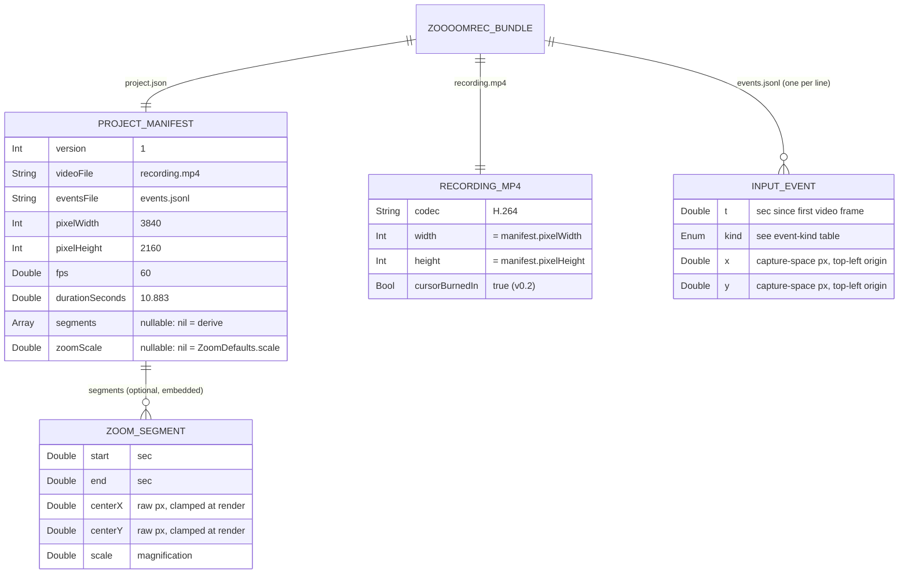
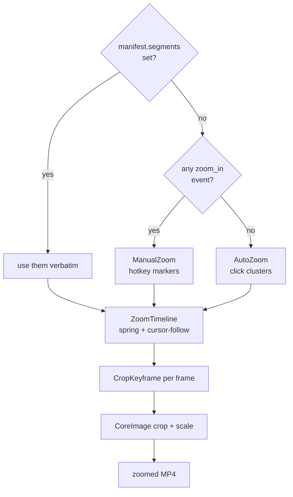
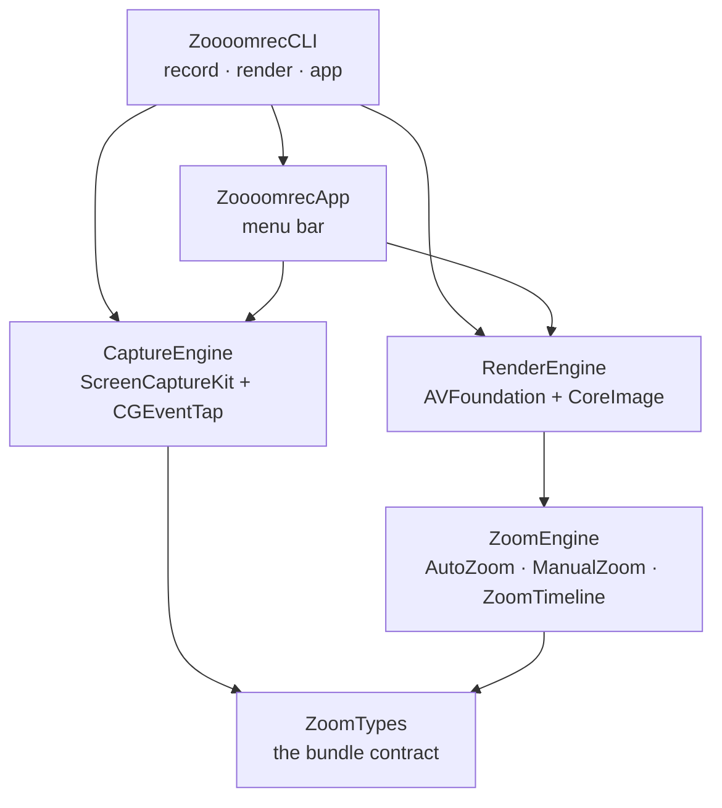

# zoooomrec — Data Model (ERD) + As-Built Architecture (2026-07-07)

> Authored from the **shipped code** at commit `9be6afa` (v0.2), not from the plan — every field below was read out of `Sources/ZoomTypes/Models.swift` and a real `project.json` on disk.
>
> Companion docs: [master plan](./zoooomrec-cross-platform-zoomable-screen-recorder-master-plan-2026-07-07.md) · [v0.2 plan](./zoooomrec-v0.2-live-hotkey-zoom-smooth-feel-menubar-2026-07-07.md)

---

## 1. Why there is no database

zoooomrec is **local-first**: nothing leaves the device, and there is no server, no Postgres, no ORM. Its data model is a **file bundle** — the `.zoooomrec` directory — plus a small set of value types.

That makes the ERD _more_ important, not less: the bundle format is the **day-1 cross-platform contract**. A recording made by the macOS app must be readable by the future iOS, Android, and Windows apps. This document is that contract.

---

## 2. Persisted data model — the `.zoooomrec` bundle

Everything below is written to disk. `project.json` and `events.jsonl` are the only schema surfaces we must keep stable across platforms.

### Two nullable fields carry all the behavior

| Field                | `nil` means                                       | Set means                                                |
| -------------------- | ------------------------------------------------- | -------------------------------------------------------- |
| `manifest.segments`  | derive zooms from the event stream at render time | use these exact zooms (an edited/manual timeline)        |
| `manifest.zoomScale` | fall back to `ZoomDefaults.scale` (2.0)           | the magnification chosen at record time (`--zoom-scale`) |

### `InputEvent.kind` enum

| Raw value                    | Emitted by                               | Used for                                    |
| ---------------------------- | ---------------------------------------- | ------------------------------------------- |
| `move`                       | 60 Hz cursor poll (no permission needed) | cursor-follow target inside a zoom          |
| `left_click` / `right_click` | CGEventTap (needs Accessibility)         | **AutoZoom** click clustering               |
| `key_down`                   | CGEventTap                               | extends an AutoZoom cluster's hold (typing) |
| `scroll`                     | CGEventTap                               | reserved; creates no segment                |
| `zoom_in`                    | **⌃⌥Z** hotkey                           | **ManualZoom** — opens a zoom / retargets   |
| `zoom_out`                   | **⌃⌥X** hotkey                           | **ManualZoom** — closes the zoom            |

> `CropKeyframe { t, rect }` is deliberately **absent from the ERD** — it is derived per-frame at render time and never persisted. Persisting it would freeze the animation and break re-rendering at a different spring feel.

---

## 3. How persisted data becomes a zoomed video

The renderer picks exactly one zoom lane, then compiles it into per-frame crop rects.

**Precedence rule (as shipped):** explicit edits > your hotkeys > inferred clicks. When you direct the zoom by hand, auto-zoom stays out of the way.

The spring that turns segments into motion:

| Parameter          | Value | Role                                                                 |
| ------------------ | ----- | -------------------------------------------------------------------- |
| `omega`            | 4.2   | attack (zoom-in) + all panning → ≈1s glide                           |
| `releaseOmega`     | 3.2   | release (zoom-out) → relaxes slower than it attacks                  |
| `deadZoneFraction` | 0.7   | cursor may roam the inner 70% of the crop before the zoom re-targets |

---

## 4. As-built module graph

Dependencies flow **downward only** — `ZoomTypes` is the shared contract and depends on nothing.

**Why this shape matters for the roadmap:** `ZoomEngine` + `ZoomTypes` contain zero platform APIs — pure Swift value types and math, covered by 25 unit tests. They port to iOS unchanged. Only `CaptureEngine` (ScreenCaptureKit → ReplayKit/MediaProjection) and the UI shell are platform-specific. That is the ~60%-reuse claim in the master plan, now concrete.

---

## 5. Cross-platform contract rules (bindings on every future port)

1. **Coordinates** are capture-space **pixels**, top-left origin — not points, not normalized. A Retina main display at 1920×1080 pt writes `pixelWidth: 3840`.
2. **Timestamps** (`InputEvent.t`, `ZoomSegment.start/end`) are seconds relative to the **first video frame's presentation time**, never process start. Events before the first frame clamp to `t = 0`.
3. **`events.jsonl` is append-only JSONL**, one `InputEvent` per line, time-sorted. Unknown `kind` values must be skipped, not fatal — this is how we add event kinds without breaking old readers.
4. **Segment centers are stored raw** (possibly out of frame). The renderer clamps per frame. One source of truth: `ZoomTimeline`.
5. **`version: 1`.** Any breaking change to the above increments it.

---

## 6. Known gaps in the model (honest list)

| Gap                                                                                                      | Impact                                                                                  | When it matters                                                                               |
| -------------------------------------------------------------------------------------------------------- | --------------------------------------------------------------------------------------- | --------------------------------------------------------------------------------------------- |
| **Main display only** — coordinates from a secondary monitor arrive negative and clamp to the frame edge | Recording a second monitor produces edge-pinned zooms                                   | Multi-display capture (next increment)                                                        |
| No audio track in the bundle                                                                             | Mic/system audio unrecorded                                                             | Master plan §5 module 1                                                                       |
| Cursor is **burned into** `recording.mp4` (`showsCursor = true`)                                         | Cannot smooth, resize, or hide the cursor in post — the Screen Studio signature feature | Synthetic-cursor work; requires capturing with `showsCursor = false` + a `cursor` event track |
| No `zoomScale` per-segment                                                                               | One magnification per recording                                                         | Per-zoom scale in the editor                                                                  |
| `scroll` events captured but unused                                                                      | Dead enum case (documented, not dead code)                                              | Scroll-driven auto-zoom, if ever                                                              |

The cursor row is the most consequential: today's bundle **cannot** produce a smoothed synthetic cursor, because the real one is already in the pixels. Fixing it is a capture-side change (`showsCursor = false` + render the cursor from the `move` track), and it is a prerequisite for the master plan's cursor features.
