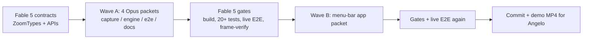

# zoooomrec v0.2 — Live Hotkey Zoom + Smooth Feel + Usable Flow (2026-07-07)

> **STATUS: SHIPPED 2026-07-07.** Wave A (commit `c075381`) + Wave B (commit `4c2e520`), 25/25 tests, live E2E green (both scenarios), menu-bar item verified on-screen. Fable 5 planned/gated; Opus 4.8 executed all 5 packets.

## Context

Angelo tested v0.1 and hit three things: (1) the zoom feels "quite hard" — the spring is too snappy (ω=8 settles in ~0.4s vs Screen Studio's ~1s glide) and the zoom center is frozen at the click point instead of following the cursor; (2) he wants **hotkeys to zoom in/out while recording**; (3) he asked whether zoom can "already work when you're recording instead of editing later."

**Answer to (3): yes — two ways, and we build the right one.** Zoom markers are captured live at the exact moment you press the hotkey, and the zoomed MP4 is rendered automatically the instant recording stops — no editing step, the finished video just appears. This keeps full-resolution capture (you can always re-render or change your mind). The alternative — baking zoom into the pixels during capture — permanently destroys the un-zoomed footage and is strictly worse; noted in the plan as an optional `--live` mode later, not built now. Fable 5 plans/gates; all implementation packets run on Opus 4.8 (per the standing model split).

## Wave A — core UX (this wave)

### A1. Live hotkeys + recording control — `Sources/CaptureEngine/*`, `Sources/ZoooomrecCLI/RecordCommand.swift`
- Extend the existing CGEventTap in `EventRecorder.swift` (already listening for clicks) to also match `keyDown` with modifiers. Default bindings (documented, collision-safe):
  - **⌃⌥Z** → `zoom_in` marker (records cursor position with it; pressing again while zoomed retargets)
  - **⌃⌥X** → `zoom_out` marker
  - **⌃⌥S** → stop recording
- `ScreenRecorder.record(durationSeconds: Double?, …)` — duration becomes optional. Without it, recording runs until stop-hotkey or Ctrl+C (SIGINT via DispatchSource → same graceful-stop path as the hotkey).
- **Instant result**: after stop, `RecordCommand` auto-renders the bundle to a sibling `<name>.mp4` by default (`--no-render` opts out, `--open` opens it when done) and prints both paths. Record → press hotkeys → stop → finished zoomed video. Zero editing.
- New flags: `--zoom-scale <x>` (default 2.0), `--no-render`, `--open`.

### A2. Zoom feel + manual-segment engine — `Sources/ZoomEngine/*`, `Sources/RenderEngine/*`, `Tests/ZoomEngineTests/*`
- **Contract change (mine, ZoomTypes)**: `InputEvent.Kind` gains `zoomIn = "zoom_in"`, `zoomOut = "zoom_out"` (additive; old bundles decode unchanged).
- New `ManualZoom.segments(from:width:height:scale:duration:)`: builds segments from marker pairs — `zoom_in` opens at the press-time cursor position, `zoom_out` closes, re-press retargets (spring glides between centers), unclosed marker runs to end of recording.
- **Precedence in `ZoomRenderer`**: explicit `manifest.segments` → else manual markers if any exist → else click-based AutoZoom. When you direct the zoom by hotkey, the auto-zoom stays out of your way.
- **Feel fixes** (the "quite hard" complaint):
  - Default `SpringConfig.omega` 8.0 → **4.2** (≈1s perceived glide), plus a gentler `releaseOmega` (**3.2**) so zoom-out relaxes slower than zoom-in attacks — the Screen Studio signature.
  - **Cursor-follow**: new `cropKeyframes(segments:events:…)` overload — inside a segment the target center tracks the cursor with a dead-zone (retarget only when the cursor leaves the inner ~70% of the crop), spring smooths the glide. Zooms feel alive instead of frozen.
- Tests: marker pairing/retarget/unclosed, precedence, dead-zone follow, no-overshoot and in-bounds invariants at the new ω values (existing 16 tests updated where timing-sensitive).

### A3. E2E update — `Sources/E2EDemo/main.swift`, `Scripts/e2e-demo.sh`
- `drive` additionally posts real hotkey presses (CGEvent keyboard events, environment is accessibility-trusted): ⌃⌥Z at ~3s over one region, glide, ⌃⌥X at ~7s.
- New assertions: manual-marker zoom active mid-hold (SSIM < 0.90 at 5s), released by 9s; plus a second short no-duration recording stopped via posted ⌃⌥S to prove the stop path.
- `patch` fallback keeps working for environments without accessibility trust.

### A4. Docs — `README.md`
Hotkeys table, the record→hotkey→instant-MP4 workflow, new flags. (Owned by a docs packet; I update the master plan + HTML twin myself.)

## Wave B — menu-bar app MVP (immediately after Wave A gates green)

`zoooomrec app` subcommand → SwiftUI `MenuBarExtra` (new `Sources/ZoooomrecApp` target, launched from the same binary so it inherits the terminal's TCC grants — proper .app bundle + signing deferred to a later wave with real distribution):
- Start/Stop Recording menu items (hotkeys displayed), recording indicator
- Zoom scale picker (1.5× / 2× / 3×), auto-render + auto-open toggles
- "Open last recording" / "Show in Finder"

Full editor GUI (timeline, backgrounds, presets — master plan §5 module 4) stays the next milestone after Angelo validates the new feel; it's a multi-week surface and should be built against a feel he already likes.

## Execution shape

Key existing code being reused (not rewritten): `EventRecorder`'s tap/polling loop, `StreamOutputHandler`, `ZoomTimeline`'s spring integrator (`SpringState`), `ZoomRenderer`'s streaming drain, the E2E SSIM assertion rig.

## Verification

1. `swift build` + full `swift test` (existing 17 + ~10 new) — gate chain per COMPLETION MANDATE.
2. `bash Scripts/e2e-demo.sh` — live 4K recording with real posted hotkeys; SSIM proof zoom engages at the ⌃⌥Z press and releases after ⌃⌥X; frame-extract + visual inspection by me.
3. Manual-feel artifact for Angelo: fresh live recording rendered at the new spring defaults → absolute MP4 path to eyeball the smoothness (the real acceptance test).
4. Wave B: launch `zoooomrec app`, record via menu, verify MP4 appears; screenshot the menu bar UI.

## Estimates (senior-eng human-equivalent)

| Item | With Claude Code | Without |
| --- | --- | --- |
| A1 hotkeys + flow | 10h | 22h |
| A2 feel + manual engine + tests | 12h | 26h |
| A3 E2E | 6h | 14h |
| A4 docs + gates | 6h | 8h |
| **Wave A total** | **34h** | **70h** (≈2.1×, ~51% saved) |
| Wave B menu-bar MVP | 14h | 30h |

Post-approval bookkeeping: copy this plan into `zoooomrec/docs/plans/` (dated name per convention) + regenerate the HTML twin.
